# Deep Research: Deltex AI Threat Protection

**Executive Summary:** Deltex AI aims to defend mobile users against a **comprehensive range of cyber threats** – from traditional malware (viruses, worms, trojans, spyware, ransomware) to modern attacks (phishing, social engineering, network-based exploits, AI-driven attacks, deepfakes, etc.).  Authoritative sources emphasize that these categories cover the most common and severe risks today.  For example, Imperva classifies *“malware, social engineering, man-in-the-middle (MitM) attacks, denial of service (DoS), and injection attacks”* as core threat categories.  Recent reports by Lookout and others confirm mobile phishing and social engineering are now pervasive, targeting users via email, SMS, voice (vishing) and messaging platforms.  Deepfakes and AI-driven social attacks are emerging rapidly; ZeroFox notes AI-generated audio/video “deepfakes” are used in scams, blackmail and misinformation, with losses in the hundreds of millions.  MITRE’s adversarial ML research highlights growing data-poisoning, model-stealing and “adversarial examples” threats against AI components.  

Deltex AI’s protection modules are designed to address this full spectrum: **Malware Protection** (virus/ransomware scanning), **Network Security** (MitM/DDoS detection), **Identity Protection** (breach monitoring, credential security), **Social Media Protection** (scam detection on social/IM channels), **Application Security** (injection/XSS scanning, supply-chain security), **AI/ML Threat Defense** (detect prompt injection, adversarial inputs, deepfakes), **Device Security** (jailbreak/root detection, camera/mic monitoring), **Privacy/Data Protection** (data leak prevention, app permission monitoring), **Fraud & Financial Protection** (transaction alerts, banking Trojan defense), **Family Safety** (content filtering, cyberbullying alerts), and **Enterprise Compliance** (audit logging, regulatory checks). Core threats are mapped to these modules (see Module-Threat diagram below). Each module has **core features** (included in lower-tier plans) and **advanced features** (premium tiers).  For example, core Malware Protection (Free/Premium) may include signature-based scanning, while advanced (Premium/Business) adds real-time behavior analysis and cloud rollback.  We assign **plan tiers** (Free, Premium, Family, Professional, Business, Enterprise) to features based on impact, e.g. device scans and phishing alerts in Free/Premium, while enterprise SIEM integration or multi-device family sharing in higher plans. 

A phased implementation is recommended: **MVP (Phase 1)** focuses on high-impact, feasible features (e.g. malware scanner, phishing/URL protection, credential breach monitoring, basic SMS/call spam filtering) over ~12 weeks with a small team. **Phase 2** (next 12 weeks, medium team) adds social-media scam detection, advanced network defense (VPN checks, MitM warnings), device/privacy tools (secure VPN, camera/mic alerts), and biometric anti-theft. **Phase 3** (final 12 weeks, large team) delivers AI-specific defenses (LLM prompt-filter, deepfake detector, adversarial ML guard), financial fraud modules, family/child safety controls, and enterprise-grade features (audit trails, compliance reporting).  This roadmap is illustrated below. 

Throughout, Deltex AI will follow best practices (e.g. OWASP, MITRE) and comply with GDPR/CCPA (data minimization, user consent for scanning personal content). The design assumes modern mobile constraints: iOS/Android permissions (e.g. **BIND_SCREENING_SERVICE** for call spam), battery optimization (background tasks, on-device AI inference), and limited background execution.  Importantly, the Figma UI/UX design is treated as the single source of truth for the frontend, per project direction, while all new features hook into the existing backend APIs.

## Threats & Vulnerabilities

The table below enumerates key vulnerabilities/threats, their vectors, detection/mitigation approaches, required data/permissions, estimated likelihood/severity, plan-tier relevance, and implementation complexity.  It draws on OWASP, MITRE, NIST, CERT and vendor sources to ensure completeness and accuracy. (Likelihood/Severity is rated *Low/Med/High* based on prevalence and impact; Complexity reflects development effort.)

| **Threat**              | **Description**                                                    | **Attack Vectors**                           | **Detection**                             | **Mitigation/Controls**                      | **Data/Perms Needed**                      | **Likelihood / Severity** | **Plans**                | **Complexity** |
|-------------------------|--------------------------------------------------------------------|----------------------------------------------|-------------------------------------------|---------------------------------------------|--------------------------------------------|--------------------------|--------------------------|---------------|
| **Malware (general)**   | Malicious software (viruses, worms, trojans, spyware, adware). Infects device via apps, downloads, email. Collects data, encrypts files, etc. | Infected apps/APKs, malicious downloads, phishing links | Signature and heuristic scanning; sandbox analysis; behavior monitoring (unusual CPU/network) | On-install scanning; real-time app monitoring; automatic quarantines; rollback/restoration | Storage access (for file scan), network access, optional accessibility service for behavior | High / High             | Free/Premium (basic AV); Professional+ (real-time, behavioral AI) | Medium |
| **Ransomware**         | Malware that encrypts user data and demands ransom. Variant of malware. | Similar to malware (email attachments, malicious apps).     | File write monitoring (detect mass encryption); honeypot detection; pattern recognition on encryption routines. | Offline backups; file-change alerts; auto-blocking known ransomware processes; decryption tools; user education. | Filesystem access, storage read/write, accessibility| Med/High                | Premium (decrypt assistance, alerts), Enterprise (admin logs) | High |
| **Spyware/Surveillanceware** | Software that covertly spies on user (keylogging, screen capture, mic/camera). Often bundled in Trojanized apps. | Infected apps, phishing installs, drive-by downloads. | Detect apps requesting suspicious permissions (mic, cam) combined with unknown source; heuristics; anomaly in battery or data use. | Permission auditing (warn user); kill or quarantine malicious apps; camera/mic LED indicators; on-device privacy firewall. | App info/permission API; optionally Accessibility for keystroke patterns | Med/High               | Free (warn on high-risk apps); Premium (active scan, auto-block) | Medium |
| **Phishing (email/URL)** | Fraudulent websites or emails that trick users into revealing credentials or installing malware. Mimics trusted entities. | Email messages, SMS links, messaging apps, malicious ads. | URL scanning via threat intel; email link sandboxing; machine-learning phishing classifiers; AI text anomaly detection. | URL filtering/blocking (local DB or cloud); SSL certificate checks; in-app browser warnings; user training/alerts. | Read SMS/Email (optional if scanning SMS); network/webview access | High/High               | Free (basic phishing URL block); Premium (AI-driven link scanning, phishing email parsing) | Medium |
| **Vishing/Smishing (Voice/SMS phish)** | Attacker calls or texts to elicit sensitive info (calls pretending to be bank, or SMS with links). | Phone calls (caller-ID spoofing), SMS messages, WhatsApp messages. | Caller ID/number reputation check; SMS content scanning (regex or ML for scam phrases); voice analysis for known scammer signals. | Spam call/SMS blocking; user alert/vetting (e.g. “caller likely scam” overlay); require MFA on sensitive actions. | Phone call info, SMS receive permission, possibly SpeechRecognition for voice analysis | High/High               | Free (OS-level spam detection); Premium (AI-driven SMS analysis, “scam likely” alerts) | Medium |
| **Caller/SMS Spam**    | Unwanted robocalls and spam text messages. Often carry phishing or ad payloads. | Phone calls (automated robocalls), SMS from shortcodes. | Use Android CallScreening API to verify caller identity; maintain blocklist of known spammers; ML spam filters for SMS. | Automatic blocking of known spam calls; silent rejection via CallScreeningService; user opt-in reporting; SMS filter. | READ_PHONE_STATE, BIND_SCREENING_SERVICE (Android); READ_SMS (if scanning SMS) | Med/Med               | Free (basic block by community list); Premium (dynamic blocklists, user reports) | Low |
| **Denial-of-Service (DoS/DDoS)** | Flooding device or network resources to disrupt service. On mobile, often targets cloud services or local network. | Botnets sending traffic; malformed network packets; aggressive app behavior. | Traffic anomaly detection (spikes in upload/download); OS-level syscall monitoring for resource exhaustion; unexpected battery draining. | Rate limiting; prioritize essential traffic; alert user of unusual traffic; recommend safer network (VPN). | Network statistics (via VPN or OS APIs); data usage monitoring | Med/High (service disruption) | Professional (network monitor), Enterprise (DDoS response integration) | High |
| **Man-in-the-Middle (MitM)** | Intercepting communications (e.g. Wi-Fi eavesdropping, DNS/IP spoofing). Steals credentials or injects malicious content. | Rogue Wi-Fi hotspots; compromised routers; DNS cache poisoning; public HTTP (no SSL). | TLS certificate pinning validation; DNSSEC or safe DNS (like DoT); Wi-Fi network analysis (detect suspicious AP). | Enforce HTTPS with cert checks; VPN usage; warn on open Wi-Fi; DNS filtering; ARP poisoning detection. | Network permissions, VPN permission (Android VPNService) | Med/High               | Free (warn on open Wi-Fi); Premium (built-in VPN, Wi-Fi scanner) | Medium |
| **SQL Injection (DB Injection)** | Malicious SQL commands inserted via app inputs (web form, API). Can expose or corrupt data. | Insecure input fields in apps or webviews; lax server APIs. | Static code analysis (in app if scanning code), runtime instrumentation; WAF on backend; parameterized query detection. | Use parameterized queries/ORM; input validation/sanitization; web app firewalls; runtime detection (bot dropping SQL payloads). | Server-side (existing APIs); for mobile, may audit app inputs or rely on backend safeguards | Med/High               | Free (reporting insecure inputs); Premium (active backend firewall integration) | High |
| **XSS and Other Injection** | Cross-site scripting or command injection via app forms. May steal cookies or run arbitrary scripts. | Webviews, in-app browsers, external content. | Content sanitization checks; CSP (Content Security Policy) enforcement; vulnerability scanning of app code. | Encode/sanitize user inputs; patch libraries; CSP/anti-XSS frameworks; alert user to suspicious script execution. | N/A (handled mostly server-side or app code) | Med/High               | Free (alerts on high-risk web content); Premium (proactive scanning) | High |
| **Supply-Chain Attacks** | Legitimate apps or libraries compromised to distribute malware. Infected updates or dev tools. | Third-party SDKs, package repositories, build servers, firmware updates. | Integrity checks (hash/signature verification on app updates); monitor dev tools for unusual changes; static analysis of dependencies. | Vet and sandbox updates; use trusted stores; implement strong code-signing; continuous monitoring of third-party code. | App binary and update permissions, internet | Med/High               | Professional (supply-chain scanning, SBOM analysis), Enterprise (audit logs) | High |
| **Social Engineering (General)** | Trick user into revealing info or installing malware (includes baiting, pretexting, etc.). | Phishing emails/SMS (covered above), physical tailgating, USB baiting. | Behavior analytics (unusual account activity); anomaly detection on user actions; context-aware warnings (“This link looks suspicious”). | User education (in-app tips); transaction confirmations; out-of-band verification; restrict app access to unknown devices. | N/A (primarily user interaction) | High/High              | Free (warnings, best-practice tips), Premium (contextual AI-driven alerts) | Low |
| **Credential Stuffing/Theft** | Attackers use stolen credentials (often from breaches) to break into accounts. | Password reuse, brute-forcing login pages, phishing capture. | Check user credentials against breach databases (have I been pwned style); monitor unusual login attempts (new device/location). | Enforce MFA; password strength policies; breach-monitoring alerts; auto-lockout after failed attempts. | User email/username (opt-in for breach check); login metadata | High/High              | Free (breach notification for email), Premium (continuous monitoring, MFA enforcement) | Medium |
| **SIM-Swap Attacks** | Attacker fraudulently reassigns victim’s phone number to their SIM, intercepting SMS/calls. | Social engineering against carrier, insider fraud. | Detect SIM changes: compare current SIM/IMSI with previous; alert on new SIM registration. | Two-factor with apps (not SMS), eSIM locking, notify user on SIM change, carrier notifications. | READ_PHONE_STATE or TelecomManager (Android) for SIM info | Med/High              | Free (SIM change alert), Premium (preventive guidance) | Low |
| **Credential Leaks/Dark Web** | User credentials or personal data appear on breached data dumps (dark web). | Data breaches at external sites, public leaks. | Dark web scanning: continuously search known dumps and paste sites for user’s email/phone. | Notify users if leaks found; force password reset; encourage 2FA. | User identifiers (email/phone hashed securely); API to breach DB | High/High              | Free (periodic breach alerts), Premium (real-time monitoring) | Medium |
| **Deepfakes/Synthetic Media** | AI-generated audio/video/images that impersonate real people. Used in CEO-fraud, fake news, blackmail. | Social media, email/video calls (scammer posing as executive). | Deepfake detection algorithms (image/video analysis for artifacts); audio analysis for lip-sync anomalies. | Verifying calls/video via alternate channels; watermarking media; user training to suspect unsolicited media. | Access to media (user photos, audio recordings) | Low/Med (emerging threat but rising) | Premium (analysis), Enterprise (strict verification) | High |
| **AI/ML Adversarial Attacks** | Attacks on AI components (data poisoning, model theft, prompt injection). | Poisoned training data, crafted inputs to LLMs, API abuse. | Input sanitization for user-generated prompts; anomaly detection on model inputs/outputs; model watermarking. | Restrict input domains; monitor output for anomalies; use robust ML models (adversarial training); token rate-limits. | Internal to AI system; not user data | Low/Med (novel but important) | Enterprise (for AI-based features) | High |
| **Zero-Day Exploits** | Attacks exploiting unknown vulnerabilities in OS or apps before patch. | Vulnerable services (Bluetooth, NFC, kernel flaws like Spectre); unpatched apps. | Behavior monitoring (sandboxing apps); anomaly detection; reputation scoring of new apps; prompt user to update. | Timely OS/app updates; minimal privileges; exploit mitigation tech (ASLR, DEP); rollback compromised components. | System-level logging (limited on mobile) | Med/High              | Premium (auto-update enforcement), Enterprise (emergency patch alerts) | High |
| **Insider Threats** | Trusted user (or compromised account) abuses access (fraud, data theft). | Malicious employee or social engineer with credentials. | Unusual account activity detection; data loss prevention (DLP) monitoring. | Principle of least privilege; audit logs; user training; mobile device management policies. | User identity (limited, mostly enterprise context) | Low/High (impact can be severe but rarer) | Enterprise (audit/log monitoring) | High |
| **Privacy/Data Leakage** | Apps or OS inadvertently expose personal data to third parties or location tracking. | Insecure storage, excessive permissions, telemetry to cloud, tracking pixels. | Permission monitoring; scanning for sensitive data in logs or outbound connections; network sniffing. | Harden permission model; block trackers; encrypt sensitive files; anonymous mode for browsing. | ACCESS_COARSE_LOCATION, READ_CONTACTS, etc. depending on scan | High/Med (pervasive issue) | Free (warn on high-risk apps); Premium (privacy firewall, tracker blocker) | Medium |
| **Fraud/Financial Attacks** | Banking Trojans, unauthorized transactions, credit card skimming apps. | Fake banking apps, phishing for creds, OTP intercept. | Monitor transactions for anomalies; scan for known banking malware signatures; AI check of transaction patterns. | Block untrusted financial apps; real-time transaction alerts; secure OTP channels (apps vs SMS). | SMS (for OTP monitoring), network, accessibility (to read screen) | Med/High              | Premium (alerts), Business (multi-account monitoring) | Medium |
| **Family Safety Threats** | Child exploitation, cyberbullying, adult content exposure online. | Social networks, chat apps, web browsing. | Content filtering (web/app category block); monitoring of chat for grooming keywords; location tracking for child safety. | Safe-search enforcement; time limits; real-time alerts on risky content or behaviors. | Accessibility (to analyze text), Internet (for content categorization) | Med/Med               | Family (web filters, alerts); Premium (advanced monitoring) | Medium |

*Notes on table:* Threats are grouped by module (e.g. Malware, Phishing, Network, etc.).  **Detection** methods combine device-based scanning (signatures, heuristics, AI/ML analysis) and cloud intelligence. **Mitigation** controls include technical measures (encryption, certificate pinning, param. queries) plus user education and alerts. Permissions (Android) like `BIND_SCREENING_SERVICE`, `READ_SMS`, `ACCESS_FINE_LOCATION`, etc. are needed for certain features (caller ID, SMS scanning, location tracking).  Severity is based on real-world impact (e.g. phishing and malware are high probability/high impact).  Plan tiers column indicates where the feature is offered: *Free* offers basic protection (e.g. alert-only, database checks), *Premium/Pro* adds active scanning and AI analysis, *Family* includes multi-device or parental controls, *Business/Enterprise* adds advanced analytics, management and compliance.

## Module–Threat Mapping

```mermaid
graph LR
    MP["Malware Protection"] --> Viruses["Viruses"]
    MP --> Trojans["Trojans / Spyware"]
    MP --> Ransomware["Ransomware"]
    SE["Social Engineering"] -.-> Phishing["Phishing (email/URL)"]
    SE -.-> Vishing["Vishing/Smishing"]
    SE -.-> Baiting["Baiting/Pretexting"]
    NI["Network Security"] --> MitM["Man-in-the-Middle"]
    NI --> DoS["DoS/DDoS"]
    NI --> WiFi["Wi-Fi spoofing / Bluetooth attacks"]
    ID["Identity Protection"] --> CredLeak["Credential Leaks (breaches)"]
    ID --> SimSwap["SIM-Swap"]
    ID --> ATO["Account Takeover"]
    SM["Social Media Protection"] --> Impersonation["Impersonation Scams"]
    SM --> RomanceScam["Romance/Investment Scams"]
    SM --> Harassment["Harassment/Bullying"]
    APPSEC["Application Security"] --> SQLi["SQL Injection"]
    APPSEC --> XSS["XSS / Code Injection"]
    APPSEC --> SupplyChain["Supply-Chain"]
    AI["AI/ML Threats"] --> Deepfake["Deepfakes"]
    AI --> AdvML["Adversarial ML"]
    AI --> PromptInject["Prompt Injection"]
    DEV["Device Security"] --> Root["Jailbreak/Root"]
    DEV --> Theft["Stolen Device"]
    DEV --> MalParam["Malicious Peripherals"]
    PRIV["Privacy/Data Protection"] --> DataLeak["Data Leakage"]
    PRIV --> Tracking["Tracker Abuse"]
    FRD["Fraud & Finance"] --> BankingTrojan["Banking Trojans"]
    FRD --> CardSkim["Card/Payment Fraud"]
    FS["Family Safety"] --> Cyberbully["Cyberbullying"]
    FS --> AdultContent["Inappropriate Content"]
    ENT["Enterprise/Compliance"] --> Insider["Insider Threat"]
    ENT --> RegFail["Regulatory Non-Compliance"]
    ENT --> AuditLog["Audit Logging"]
    
    style MP fill:#FFCCCC,stroke:#333,stroke-width:2px
    style NI fill:#CCFFCC,stroke:#333,stroke-width:2px
    style ID fill:#CCCCFF,stroke:#333,stroke-width:2px
    style SM fill:#FFE699,stroke:#333,stroke-width:2px
    style APPSEC fill:#CCCCCC,stroke:#333,stroke-width:2px
    style AI fill:#FFCCFF,stroke:#333,stroke-width:2px
    style DEV fill:#CCFFFF,stroke:#333,stroke-width:2px
    style PRIV fill:#FFEECC,stroke:#333,stroke-width:2px
    style FRD fill:#FFDCDC,stroke:#333,stroke-width:2px
    style FS fill:#E0DFFF,stroke:#333,stroke-width:2px
    style ENT fill:#D5E8D4,stroke:#333,stroke-width:2px
```



## Protection Modules & Features

- ### Malware Protection  
  **Core:** Signature-based scan of apps/files, known threat database updates, heuristic alerts. (*Included in Free & above.*)  
  **Advanced:** Real-time behavior monitoring (detours, virtualization), automated rollback of malicious changes, anti-sideload protection, cryptojacking detection. (*Premium/Professional*.)  

- ### Network Security  
  **Core:** Public Wi-Fi warning, VPN access, HTTPS enforcement, known-bad DNS blocking. (*Free/Premium.*)  
  **Advanced:** Intrusion detection (flag unusual traffic), Wi-Fi/man-in-the-middle detection (e.g. HTTPS spoofing alerts), anti-ARP spoofing. (*Professional/Business*.)  

- ### Identity Protection  
  **Core:** Breach/Dark-Web monitor for user’s email/credentials, SIM-change alerts, basic password health check. (*Free/Premium.*)  
  **Advanced:** Real-time credential stuffing/blocking, OAuth account breach alerts, automated MFA deployment. (*Premium/Professional.*)  

- ### Social Media Protection  
  **Core:** Scanning of social posts/messages for scams (investment, romance, tech support), fake account detection, privacy settings checkers. (*Premium/Family*.)  
  **Advanced:** AI chat analysis to detect grooming or deepfake impersonations in video chats, link scanning inside apps. (*Business/Enterprise, Family Safety*)  

- ### Application Security  
  **Core:** Scan installed apps for known vulnerabilities (e.g. outdated libraries), flag high-risk permissions, enforce least privilege. (*Free/Premium*.)  
  **Advanced:** Inject protection (detect attempts of code injection/SQLi in apps), vulnerability scanning of apps (OWASP top ten testing), app sandbox monitoring. (*Professional/Enterprise*.)  

- ### AI/ML Threat Defense  
  **Core:** Filter user inputs to ML models (sanitize prompts), block known malicious AI content. (*Premium/Business*.)  
  **Advanced:** Adversarial example detector, model integrity checks, AI behavior analytics, rapid patching of discovered adversarial vectors. (*Enterprise*.)  

- ### Device Security (Physical Protections)  
  **Core:** Device encryption status check, biometric lock enforcement (ensure FaceID/fingerprint enabled), remote-find & wipe. (*Free/Premium*.)  
  **Advanced:** Rogue access (OTG/jailbreak) detection, SIM spoof detection, false base station alerts, anti-theft cameras (captures photo of thief). (*Professional/Enterprise*.)  

- ### Privacy & Data Protection  
  **Core:** Permissions firewall (e.g. alert if an app accesses camera/mic unexpectedly), tracker/ad blocker for browsers, safe-search enforcement. (*Free/Premium*.)  
  **Advanced:** Private DNS, on-device ad/tracker blocking for apps, clipboard monitoring (warn on accidental sensitive data share). (*Premium/Family*.)  

- ### Fraud & Financial Protection  
  **Core:** Alerts for banking malware behavior (e.g. overlay UI), credit card theft alerts, one-click card freeze via bank API. (*Premium/Business*.)  
  **Advanced:** Transaction anomaly detection (using AI), secure vault for payment apps (isolated environment), automated fraud report generation. (*Enterprise*.)  

- ### Family Safety  
  **Core:** Web/App content filters (pornography, violence); screen-time management; location tracking for children. (*Family plan.*)  
  **Advanced:** Chat/Cyberbullying detection (flag suspicious keywords in messages), SOS alerts, remote device lockdown. (*Family, Enterprise (child protection packages)*.)  

- ### Enterprise & Compliance  
  **Core:** Aggregated risk dashboards (overall protection score, top alerts), centralized policy control (push settings to devices), basic audit logs. (*Business/Enterprise*.)  
  **Advanced:** SIEM integration, compliance checks (GDPR, HIPAA logs), multi-tenant admin console, custom alert rules. (*Enterprise*.)  

Each feature is mapped to plan tiers so that **Free** users get essential protection and Premium/Professional adds AI and on-demand scans, while **Business/Enterprise** gain large-scale management, analytics and compliance tools.  For example, phishing URL blocking and breach alerts are Free/Premium features, whereas advanced AI-model security and SIEM export are Enterprise-only.

## Roadmap & Timeline

We recommend a three-phase rollout.  **Phase 1 (MVP)** – 12 weeks with a *small team* – implements core protections for malware, phishing, credential breaches, and basic SMS/call spam filtering. **Phase 2** – next 12 weeks with a *medium team* – adds social-media scam detection, advanced network defense, device/privacy tools and parental controls. **Phase 3** – final 12 weeks with a *large team* – delivers AI-driven defenses (deepfake/adversarial detection, AI assistant), financial fraud modules, and full enterprise/compliance features. Each phase ends in a release milestone.  The high-level schedule is shown below:

```mermaid
timeline
    title Deltex AI Development Roadmap
    section Phase 1: MVP (12 weeks)
    2026-07 : Begin core dev (malware, phishing, breach monitoring)  
    2026-08 : Beta release (basic scanning, alerts)  
    2026-09 : MVP launch (version 1.0)  
    section Phase 2: Expansion (12 weeks)
    2026-10 : Start Phase 2 dev (social, device, network modules)  
    2026-11 : Midpoint (pre-release testing)  
    2026-12 : Phase 2 launch (version 2.0)  
    section Phase 3: Advanced (12 weeks)
    2027-01 : Start Phase 3 dev (AI/enterprise features)  
    2027-02 : Final testing and integration  
    2027-03 : Full platform launch (version 3.0)  
```

**Resource Estimates:** MVP with a core dev team (≈3–5 engineers), Phase 2 adds specialists (UI/UX, ML) for a medium team, Phase 3 scales to a larger cross-functional team (10+ including security analysts) to handle advanced features and enterprise integration.

## Implementation Notes

- **Mobile Constraints:** Deltex AI must operate within iOS/Android restrictions.  For example, *Android* allows call/SMS scanning via the `CallScreeningService` and background services, whereas *iOS* heavily limits third-party call-blocking and app-oversight.  Permission requests must be judicious: e.g. `BIND_SCREENING_SERVICE` for spam calls, `READ_SMS/READ_CALL_LOG` for SMS filtering (Android), `ACCESS_FINE_LOCATION` for location-based alerts. Background scanning should use JobScheduler/WorkManager to minimize battery drain. On-device AI inferences (for deepfake or chat analysis) should use optimized models (TensorFlow Lite) to conserve resources. Biometric and encryption features rely on platform APIs (e.g. Android Keystore, iOS Secure Enclave). 

- **Privacy & Permissions:** Any scanning of personal data (messages, contacts, media) requires user consent and data minimization. For example, SMS or call analysis should be opt-in and anonymized. The app should use privacy-friendly APIs; e.g. Android’s SMS retriever rather than broad SMS read. Logs or breach monitoring should use hashed identifiers, not raw PII, and comply with GDPR/CCPA (data retention limits, “right to be forgotten”). Network features (VPN, DNS) must clearly disclose data handling. Notifications and alerts should explain why data is accessed (e.g. “only scanning SMS for phishing links”). Adhering to platform privacy guidelines (Android 13+ restricts background location, etc.) is mandatory.

- **Legal/Regulatory:** Many features (call/SMS scanning, content filtering) intersect with privacy laws. Ensure opt-in and clear privacy policy for scanning user communications. Location or contact monitoring features must allow user disablement. Fraud monitoring (e.g. banking) should comply with financial data protection laws. For dark-web monitoring, inform users how and where their credentials are checked. Enterprise plans should include compliance modules (e.g. automated GDPR readiness reports, audit logs) to assist with internal policies and legal frameworks.

This comprehensive threat analysis and module plan – backed by sources like OWASP/MITRE/CISA/Lookout – provides a roadmap for Deltex AI to become a robust, AI-driven mobile security platform. By prioritizing high-impact defenses (phishing, malware, identity theft) and progressively adding advanced capabilities (AI threats, enterprise integration) as shown above, Deltex AI can deliver maximum protection and value across Free to Enterprise tiers.

**Sources:** Authoritative security resources and industry reports were used, including Imperva (threat categories), NIST (malicious code definitions), MITRE (adversarial ML threats), OWASP (injection/XSS risks), Android Developer documentation (call-screening API), Lookout (mobile threat trends), ZeroFox (deepfake use cases), Duke Univ. guide (device encryption/best practices), and others. These ensure the above analysis is grounded in current best practices.