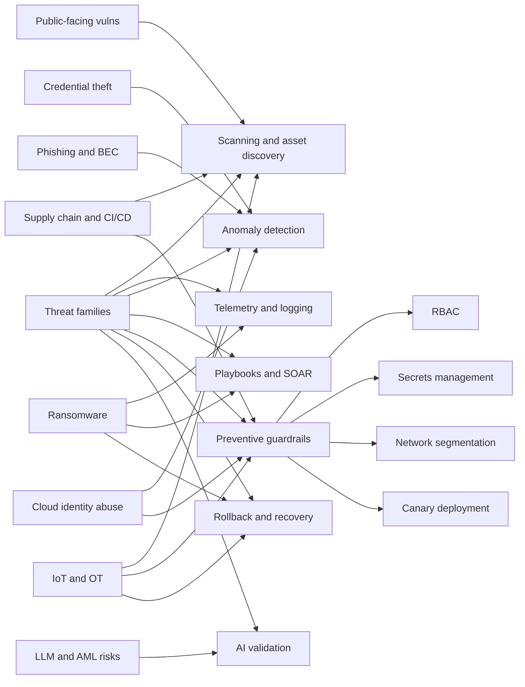
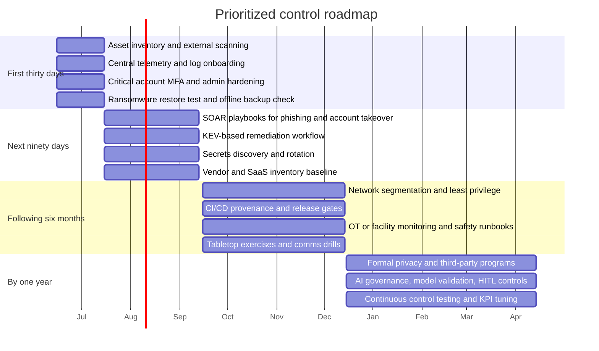

# Cyber-Automation Protection Report

## Executive summary

A cyber-automation system built around continuous scanning, telemetry collection, anomaly detection, automated response playbooks, orchestration, configuration enforcement, secrets handling, rollback, and model validation can materially reduce exposure to the highest-volume and fastest-moving threats that today dominate real incidents: exploitation of public-facing vulnerabilities, credential theft and password spraying, phishing and business email compromise, ransomware, cloud identity abuse, misconfiguration, shadow assets, and many forms of third-party or supply-chain compromise. NIST CSF 2.0 now frames this lifecycle explicitly through six functions—Govern, Identify, Protect, Detect, Respond, and Recover—and NIST SP 800-61 Rev. 3 ties incident response to those functions, emphasizing prevention, preparation, detection, containment, eradication, recovery, and communications as one integrated discipline. citeturn44search9turn44search10turn44search5

The strongest evidence-backed use cases for automation are external attack-surface management, vulnerability and misconfiguration discovery, identity anomaly detection, phishing triage, rapid token/session revocation, endpoint isolation, secrets rotation, log-driven investigation, and recovery acceleration through tested rollback and backup workflows. CISA’s Cyber Hygiene service is a direct example of automated continuous scanning for internet-exposed assets, while NIST’s continuous monitoring and log-management guidance stress persistent visibility and automatable testing as prerequisites for sound risk response. citeturn17search1turn17search3turn17search12turn8search7

The same research and standards also show the limits of automation. Formal plans and policy are still essential for identity governance, privileged access, legal/privacy obligations, third-party risk, backup and disaster recovery, software supply-chain assurance, OT safety windows, insider risk, crisis communications, and AI governance. For AI-enabled security operations specifically, NIST’s AI RMF, AI TEVV work, adversarial-ML taxonomy, and OWASP’s LLM security guidance all point to risks that tooling alone does not remove: prompt injection, insecure output handling, model poisoning, model denial of service, excessive agency, sensitive information disclosure, model theft, drift, and unvalidated autonomous decisions. citeturn25search1turn25search0turn15search0turn15search3turn15search11turn44search6turn44search15

By stakeholder, the priorities differ. Individuals and families are dominated by phishing, impersonation, account takeover, device theft, and insecure smart-home devices. Small businesses and companies face the same identity risks plus ransomware, cloud/SaaS misconfiguration, exposed secrets, CI/CD compromise, and third-party dependency. NGOs add higher risks around beneficiary or activist data, doxxing, travel and field operations, and resource-constrained response. Governments and institutional facilities face the highest concentration of legacy-system risk, nation-state or hybrid threats, public-service disruption, unsupported edge devices, and cyber-physical consequences in OT, medical, or building systems. Current sector evidence reinforces those distinctions: Verizon’s 2025 DBIR found exploitation of vulnerabilities at 20% of breaches and third-party involvement doubled from 15% to 30%; Microsoft reports government agencies, IT, and research as the most impacted sectors, with NGOs also heavily targeted; the FBI reports more than $3.0 billion in BEC losses and almost $893 million in AI-related cybercrime losses in 2025; and NetHope reports 65% of nonprofit members experienced a security breach in the preceding year. citeturn40view0turn42view0turn32view0turn35view3turn37view3turn9search14

## Analytical lens and automation capabilities

This report treats “vulnerabilities” broadly, because modern compromise is rarely a single technical flaw. Relevant exposures include technical weaknesses such as unpatched software, insecure APIs, weak identity controls, exposed secrets, cloud and container misconfigurations, poor logging, and OT/IoT insecurity; human weaknesses such as phishing susceptibility, shadow IT, over-broad app consent, bad recovery practices, and insider error or misuse; physical weaknesses such as stolen devices, unauthorized facility access, rogue peripherals, and tampering; supply-chain weaknesses across software, SaaS, MSPs, CI/CD, and hardware; privacy and regulatory weaknesses such as excessive retention or poor breach notification readiness; and AI-specific weaknesses such as prompt injection, insecure output handling, training-data poisoning, evasion, model theft, and unsafe agent autonomy. NIST SP 800-53 Rev. 5 explicitly spans access control, audit, contingency planning, identification and authentication, incident response, system and information integrity, privacy, and supply-chain risk management, which is why it remains a useful backbone for classifying these exposures. citeturn43view1

A practical automation stack typically includes several control families. Continuous scanning covers asset discovery, external exposure mapping, vulnerability scanning, configuration assessment, software composition analysis, SBOM comparison, and CI/CD hygiene checks. Telemetry and logging provide the evidence base across endpoints, identities, email, APIs, cloud control planes, SaaS, network flows, and OT/BMS. Anomaly detection turns that telemetry into alerts for suspicious authentication, privilege changes, impossible travel, OAuth abuse, segment pivots, data staging, or ransomware behaviors. Response automation then uses playbooks and SOAR to quarantine hosts, disable accounts, revoke tokens, block indicators, rotate secrets, open tickets, notify stakeholders, and coordinate cross-tool actions. Rollback and canary deployment techniques reduce self-inflicted harm from automated patching or remediation. For AI-enabled systems, model validation and TEVV functions are the equivalent guardrails that keep detection models or security agents from operating blindly. citeturn17search3turn17search1turn8search15turn44search5turn25search0turn25search2

The risk categories most clearly suppressible through automation are those where signals are plentiful and response actions are well-bounded. Examples include scanning for known exploited vulnerabilities, spotting password spraying, detecting brute force and impossible-travel events, identifying phishing by sender/domain/content anomalies, flagging cloud abuse and malicious OAuth consent, surfacing lateral movement through identity or east-west telemetry, and containing ransomware before encryption spreads. MITRE ATT&CK’s Initial Access, Credential Access, Lateral Movement, and Impact tactics align closely with those automation use cases, while Microsoft’s current incident data show that identity abuse and public-facing exposure continue to be core attacker entry points. citeturn29search2turn29search0turn29search1turn29search3turn36view0turn32view0

The residual category—the one that *requires* governance—is where automation can assist but not decide in isolation. That includes acceptable use rules, vendor trust thresholds, risk appetite, law-enforcement engagement, privacy balancing, executive communications, contractor offboarding, offline backup strategy, safety review before OT patching, and human review for high-impact AI-driven response actions. This report therefore treats automation-specific failure modes as first-order risks in their own right: over-privileged playbooks, stale or incomplete asset inventories, false positives and false negatives from anomaly models, missing telemetry, cascading containment errors, bad patch rollouts, integration failures across APIs, and AI-agent prompt injection or objective drift. Those are partly an inference from NIST continuous-monitoring, incident-response, AI TEVV, and autonomous cyber-defense literature, all of which stress testability, validation, and human oversight for risky actions. citeturn17search3turn44search5turn25search0turn31search3turn31search0turn26search14

## Stakeholder risk analysis

**Individual.** The highest-probability vulnerabilities are credential reuse, weak account recovery, phishing and impersonation scams, malicious browser extensions or app permissions, device theft, unsafe Wi-Fi or router configuration, exposed cloud storage, and privacy leakage from social or messaging accounts. Automation protects individuals best through identity anomaly detection, breach/password reuse checking, device posture checks, auto-updates, anti-phishing screening, suspicious-login alerts, and rapid session/token revocation. Formal “plans” here should be lightweight but explicit: a personal recovery checklist for primary email, banking, telecom accounts, and cloud backups. FTC and FBI data show the continued scale of impersonation and fraud, while Microsoft’s data show that modern MFA remains one of the most effective identity protections. citeturn11search11turn11search3turn18search2turn18search10turn36view2turn36view3

**Family.** Families inherit most individual risks and add shared devices, shared payment methods, children’s or elders’ exposure to scams, and insecure smart-home devices whose compromise can affect privacy and physical safety. Relevant vulnerabilities include reuse of the same credentials across household services, lack of MFA on “root” family accounts, smart cameras or voice assistants on the main LAN, default passwords, parental-control bypass, and poor backup habits for family photos, documents, and medical or school records. Automation is especially effective here through household-wide password-manager alerts, smart-home update automation, guest-VLAN or segmented IoT monitoring, safe-browsing controls, family security notifications, and rapid isolation of suspect devices. NIST’s smart-home guidance is explicit that smart-home technologies raise security, privacy, and physical-safety risks, and its more recent consumer guidance emphasizes authentication, unique passwords, disabling unused features, and privacy settings. citeturn11search18turn11search2

**Small business and company.** The relevant threat surface expands sharply: exposed VPNs and edge devices, SaaS sprawl, BEC, ransomware, public-facing application weaknesses, cloud object-store misconfiguration, API abuse, secrets in code or CI/CD, unmanaged endpoints, shadow IT, and third-party dependence. For software-producing firms, CI/CD compromise, insecure GitHub Actions or other workflows, unsigned builds, poisoned dependencies, and weak provenance become material business risks; for non-software firms, vendor and SaaS trust chains are usually the bigger problem. Automation features with the highest return are public-asset scanning, KEV-centric patching, centralized identity monitoring, phishing detonation and mailbox triage, endpoint containment, SaaS posture checks, secrets detection/rotation, and SOAR playbooks for BEC, ransomware, privileged-account changes, and high-severity cloud alerts. NIST’s CSF 2.0 small-business guidance, CISA’s SMB guidance, Verizon’s breach data, and Microsoft’s current identity findings all support emphasizing asset inventory, identity hardening, and fast remediation over compliance theater. citeturn12search0turn12search1turn12search13turn40view0turn42view0turn36view0turn36view2

**NGO.** NGOs share SMB risks but often handle more sensitive beneficiary, donor, whistleblower, or activist data while operating with tighter budgets, more volunteers, more travel, and higher exposure to harassment or targeted surveillance. Key vulnerabilities include spearphishing against leadership or field staff, hijacking of campaign or donation channels, doxxing and account takeover, insecure partner collaboration, device seizure or loss in transit, weak offboarding for temporary staff/volunteers, poor minimization of mission-sensitive data, and limited monitoring coverage. Automation is valuable for detecting malicious sign-ins, suspicious mailbox behavior, donation/payment anomalies, exposed cloud drives, and location- or travel-driven account risk, but NGOs still need written protocols for emergency support, travel devices, data minimization, and communications if public channels are compromised. This is exactly why SAFETAG focuses on organizational practice and policy review for at-risk nonprofits, why CISA curates resources for high-risk communities, and why Access Now and Front Line Defenders maintain rapid-support guidance. NetHope’s latest findings show both the urgency and resource gap in this sector. citeturn10search4turn10search0turn10search2turn9search6turn10search1turn9search14

**Government.** The defining vulnerabilities are legacy systems, unsupported edge devices, broad citizen-data stores, privileged account sprawl, inter-agency dependencies, contractor and supplier risk, exposed public services, hybrid-cloud identity abuse, ransomware, and nation-state intrusion campaigns aiming either at espionage or service disruption. Automation materially helps by continuously scanning public attack surface, prioritizing actively exploited vulnerabilities, detecting unusual privileged activity, revoking compromised tokens, orchestrating cross-agency incident handling, and segmenting crown-jewel systems from general-purpose infrastructure. Yet governments also have the strongest need for formal governance because response decisions implicate law, records retention, essential public services, procurement, and sometimes public trust or democratic legitimacy. Current evidence is unusually consistent: Microsoft lists government agencies and services as one of the most impacted sectors; Verizon reports ransomware in 30% of public-sector breaches; CISA emphasizes nation-state and critical-infrastructure targeting; and CISA’s newer directives highlight the risk of unsupported edge devices and the need to prioritize patching against risk and active exploitation. citeturn32view0turn38view0turn27search1turn24search4turn24search0turn24search22

**Institutional facilities.** This category includes hospitals, schools, universities, campuses, laboratories, building complexes, and industrial or research facilities that combine IT with cyber-physical infrastructure. Their distinct vulnerabilities include OT/ICS and BMS exposure, legacy medical or lab devices, campus identity sprawl, public or guest networks, research-data theft, access-control and CCTV dependence, and safety-critical maintenance windows where “patch now” is not always the right answer. Automation is powerful for inventorying connected devices, enforcing IT/OT segmentation, monitoring abnormal east-west traffic, isolating affected zones, validating backups, and alerting on suspicious access-control or BMS activity—but every high-impact automated action should be constrained by safety-aware runbooks and rollback paths. NIST’s ICS guidance, building-systems work, HHS’ healthcare cybersecurity practices, CISA’s K–12 guidance, and NCSC guidance for higher education all support treating facilities as cyber-physical environments, not just office IT. citeturn2search0turn20search2turn20search0turn20search11turn21search0turn21search2

The priority ratings below are analytical judgments derived from the standards and sector evidence above. They should be read as a cross-source synthesis, not as a single-source benchmark. citeturn44search9turn44search5turn40view0turn42view0turn32view0turn38view0turn9search14

| Stakeholder | Highest-priority vulnerability clusters | Impact | Likelihood | Recommended measurable controls and KPIs |
|---|---|---:|---:|---|
| Individual | Phishing/impostor scams; account takeover from credential reuse; device theft/privacy leakage | High | Very High | MFA/passkey coverage on critical accounts ≥ 95%; unique-password reuse rate = 0; auto-update coverage = 100%; mean time to lock compromised primary email < 15 minutes |
| Family | Household root-account compromise; child/elder scam exposure; insecure IoT/smart-home devices | High | High | Root-account MFA = 100%; household IoT on separate/guest network ≥ 90%; quarterly backup restore test success = 100%; number of default-password devices = 0 |
| Small business/company | Credential abuse/BEC; ransomware and backup sabotage; public-facing/cloud/SaaS misconfiguration; third-party spillover | Very High | Very High | External asset inventory accuracy ≥ 95%; KEV remediation SLA attainment ≥ 95%; phishing-resistant MFA on admins = 100%; restore test success monthly = 100%; median age of critical vulns < 7 days |
| NGO | Spearphishing/account takeover; beneficiary-data exposure or doxxing; insecure partner/volunteer access; field-device loss | Very High | High | Hardware MFA for high-risk staff ≥ 95%; mission-sensitive data stores inventoried/classified = 100%; emergency contact/playbook drills twice yearly; privileged/partner account recertification every quarter |
| Government | KEV/legacy exploitation; privileged identity abuse; ransomware and public-service disruption; unsupported edge devices; supplier risk | Very High | Very High | Unsupported edge devices retired = 100%; privileged sessions fully logged = 100%; KEV/critical risk remediation on time ≥ 95%; mean time to contain priority incidents < 1 hour; recovery objectives met in exercises ≥ 90% |
| Institutional facilities | Ransomware-driven downtime; OT/BMS/medical-device segmentation gaps; research or patient/student data exposure; insider error during turnover | Very High | High | OT/IoT asset inventory completeness ≥ 95%; IT/OT segmentation exceptions = 0 without approved waiver; safety-impacting cyber change incidents = 0; telemetry coverage for access-control/BMS/medical networks ≥ 90% |

## Vulnerability-to-mitigation mapping

The matrix below is a synthesis of NIST CSF 2.0, NIST SP 800-61r3, NIST SP 800-53, NIST SP 800-207, NIST SP 800-161r1, NIST SP 800-82r3, NIST AI RMF and TEVV work, OWASP Top 10/API/LLM/Kubernetes guidance, MITRE ATT&CK, CISA practice guides, and recent incident evidence. “S” means the feature is a strong primary mitigation; “M” means it is a meaningful supporting mitigation; “L” means limited or indirect usefulness. citeturn44search10turn44search5turn43view1turn1search1turn1search0turn2search0turn25search0turn44search6turn15search3turn19search3turn29search4turn17search1

| Vulnerability family | Scan | Anom | Patch | Playbooks | SOAR | RBAC | Secrets | Seg | Decep | T/L | IR orch | Rollback / Canary | Model val |
|---|---:|---:|---:|---:|---:|---:|---:|---:|---:|---:|---:|---:|---:|
| Public-facing vulns and weak edge devices | S | M | S | M | M | L | L | M | L | S | M | M | L |
| Credential theft, password spray, brute force | M | S | L | S | S | S | M | M | L | S | S | L | L |
| Phishing, BEC, social engineering | M | S | L | S | S | M | L | L | L | S | S | L | L |
| Malware and ransomware | M | S | S | S | S | M | M | M | M | S | S | S | L |
| Data tampering / integrity attacks | M | S | M | S | S | M | M | M | L | S | S | S | L |
| Lateral movement / privilege escalation | L | S | M | S | S | S | M | S | M | S | S | L | L |
| Cloud identity abuse / OAuth / token theft | M | S | L | S | S | S | M | M | L | S | S | L | L |
| Misconfiguration / shadow assets / exposed storage | S | M | M | M | M | M | M | M | L | S | M | S | L |
| Third-party / supply chain / CI/CD compromise | S | M | M | S | S | M | S | M | L | S | S | S | M |
| IoT / OT / BMS / medical-device exposure | S | S | M | S | S | M | L | S | M | S | S | M | L |
| Privacy / PII leakage / excessive retention | M | M | L | M | M | S | M | M | L | S | M | L | M |
| Insider misuse / human error | L | S | L | S | S | S | M | M | L | S | S | L | M |
| DDoS / availability-of-service events | M | S | L | S | S | L | L | M | M | S | S | L | L |
| LLM prompt injection / insecure output / excessive agency | L | M | L | M | M | S | M | S | L | S | M | M | S |
| AML poisoning / evasion / model theft / drift | L | M | L | L | L | M | M | L | L | S | M | L | S |
| Automation failure modes / playbook misfires / cascading response | L | M | M | M | M | S | S | M | L | S | S | S | S |

A useful operational interpretation is simple. If the problem is *known exposure*, scanning and patch/configuration automation lead. If the problem is *unknown malicious behavior*, telemetry plus anomaly detection lead. If the problem is *time-to-containment*, playbooks and orchestration lead. If the problem is *blast radius*, RBAC, secrets control, and segmentation lead. If the problem is *AI-enabled defense itself*, model validation and human review become mandatory companions rather than optional extras. citeturn17search3turn8search15turn36view2turn25search0turn44search6

## Which exposures need formal plans

The table below distinguishes exposures that can be handled mostly with operational controls from those that require approved plans or policy because they involve governance, external coordination, safety, privacy, or legal judgment. The need for formal documentation is strongest where NIST, ISO, or CISA guidance stresses enterprise-wide governance, supplier management, privacy management, AI oversight, contingency planning, or incident communications. citeturn22search0turn22search1turn23search0turn23search1turn43view1turn44search5turn18search3

| Vulnerability / risk area | Formal plan or policy required | Why tooling alone is insufficient | Stakeholders that most need it |
|---|---|---|---|
| Incident response and communications | Incident response plan, escalation matrix, notification and communications playbooks | Decisions affect legal notification, leadership, public trust, and external coordination | Small business/company, NGO, government, institutional facilities |
| Backup, business continuity, disaster recovery, ransomware | Backup policy, restore plan, BCP/DR plan, recovery priorities | Recovery order, offline copies, tolerable downtime, and external dependencies require predecision | Family (simplified), business/company, NGO, government, institutional facilities |
| Identity lifecycle and privileged access | IAM/PAM policy, joiner-mover-leaver process, break-glass rules | Automation cannot define who should have access, for how long, or under emergency authority | Business/company, NGO, government, institutional facilities |
| Vendor and supply-chain risk | Third-party risk management policy, procurement controls, SBOM/SLSA/contract requirements | Trust thresholds, due diligence, and acceptance of vendor risk are governance decisions | Business/company, NGO, government, institutional facilities |
| Privacy, PII handling, retention, data sharing | Data classification, retention, privacy impact / privacy management policies | Requires balancing mission, consent, jurisdiction, and minimization—not just detection | NGO, government, institutional facilities, any company holding PII |
| Insider threat | Insider threat program, HR/legal due-process policy, monitoring rules | Sensitive to labor law, ethics, investigations, and proportionality | Business/company, NGO, government, institutional facilities |
| Secure SDLC and CI/CD | Secure development policy, release gates, provenance/signing requirements | Tool output does not choose acceptable developer practices or release authority | Software-producing companies, digital-service NGOs, governments, universities/labs |
| OT / ICS / BMS / medical or lab systems | Safety-aware change management and maintenance-window policy | Automated action can create physical harm or service disruption | Government operators, hospitals, campuses, industrial/research facilities |
| AI use in security operations | AI governance policy, HITL approval rules, model validation/monitoring plan | Prompt injection, drift, and unsafe autonomy demand defined accountability | Companies using AI security agents, NGOs, governments, institutional facilities |
| Acceptable use, BYOD, shadow IT | Acceptable-use and BYOD policies | Tooling cannot by itself define what devices or apps are permitted | Business/company, NGO, institutional facilities |
| Household cyber resilience | Household recovery checklist, device/account inventory, trusted-contact list | Consumer incidents still need explicit recovery sequencing | Individual, family |
| DDoS and critical-service continuity | Service continuity plan, failover plan, comms playbook | Availability protection crosses technical, contractual, and communications domains | Companies, governments, institutional facilities |

Operational controls alone are usually adequate only after those policy baselines exist. Examples include continuous vulnerability scanning, automated quarantine of a single endpoint, real-time token revocation, mailbox triage, routine secret rotation, log collection, and low-risk patching of non-critical assets. Even there, success depends on approved thresholds, maintenance windows, ownership, and rollback criteria. citeturn17search1turn17search3turn8search7turn44search5

## Implementation roadmap and KPIs

A defensible rollout sequence is to start with visibility, then harden identity, then automate containment, then formalize resilience and supplier controls, and finally extend into OT and AI assurance. This order is consistent with NIST CSF 2.0, NIST’s incident response guidance, CISA’s vulnerability-scanning model, and sector evidence showing that attackers disproportionately win through unmanaged exposure, weak identity protection, and slow response. citeturn44search10turn44search5turn17search1turn40view0turn36view0

**Recommended KPI set.** Track coverage, speed, quality, and resilience. For coverage: asset inventory completeness, telemetry coverage, public-facing asset coverage, MFA coverage, privileged-account inventory coverage, SBOM coverage for critical software, and OT/IoT inventory completeness. For speed: mean time to detect, mean time to contain, mean time to recover, median age of critical and KEV-listed vulnerabilities, median time to rotate exposed secrets, and restore time from last known-good backup. For quality: false-positive rate on automated detections, percentage of playbooks with human approval gates where required, percentage of auto-remediations that succeed without rollback, model-evaluation pass rate, and incident postmortem completion rate. For resilience: percentage of recovery objectives met in exercises, rate of successful restore tests, number of unsupported edge devices remaining, segmentation-rule exception count, and safety-impacting cyber changes. NIST’s monitoring and log-management guidance supports this kind of metric-backed continuous improvement. citeturn17search3turn17search12turn8search7turn8search15

The roadmap below prioritizes controls that reduce the largest current loss drivers first: exploitable exposure, credential abuse, ransomware containment, and supplier dependence. citeturn40view0turn42view0turn36view0turn35view3

## Open questions and limitations

This report is strongest on cross-sector, standards-based vulnerability classes and automation patterns; it is intentionally not a substitute for a jurisdiction-specific compliance opinion, a sector-specific safety case, or a threat model tailored to one named organization. Quantitative likelihood and impact ratings are synthesis judgments informed by the cited standards and incident reports rather than scores published by any one source. The NGO and institutional-facility sections also reflect a wider range of operating models than the other stakeholder groups, so local context—conflict exposure, campus openness, hospital device constraints, or research sensitivity—can materially change priority order. citeturn44search10turn44search5turn9search14turn20search2turn20search0turn21search0turn21search2

The largest unresolved design question for any cyber-automation program is not whether to automate, but **where to place approval boundaries**. High-confidence, low-blast-radius actions such as alert enrichment, token revocation for clearly malicious sessions, quarantining a single workstation, or opening tickets are strong candidates for full automation. High-impact actions—mass account disablement, production patching during unknown dependencies, OT isolation, public communication, enforcement against insiders, or AI-agent actions with open-ended authority—still warrant human review, runbook validation, and measured rollback paths. That conclusion is consistent with the direction of current NIST incident-response, AI-RMF, TEVV, and autonomous-defense work. citeturn44search5turn44search6turn25search0turn31search3